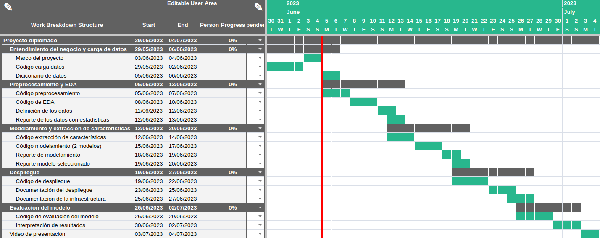

# Project Charter - Entendimiento del Negocio

## Nombre del Proyecto

**OceanHeatMLFlow: Predicción del Flujo de Calor en el Subsuelo Oceánico utilizando metodologías y Algoritmos de Aprendizaje Automático**

## Objetivo del Proyecto

Comparar el desempeño de diversos algoritmos de machine learning mediante el uso de métricas de evaluación adecuadas, con el fin de predecir el flujo de calor en el subsuelo oceánico utilizando datos de grosor sedimentario recopilados de diferentes bases de datos.

## Alcance del Proyecto

### Incluye:

- **Descripción de los datos:** En este proyecto se utilizarán datos provenientes de dos bases de datos, con cobertura global, que proporciona información detallada sobre la distribución espacial de los datos: 
    * **[Total Sediment Thickness of the World's Oceans and Marginal Seas Version 3 (GlobSed)](https://www.ngdc.noaa.gov/mgg/sedthick/):**  la cual contiene mediciones del grosor total de los sedimentos en los océanos y mares marginales a escala global. Ofreciendo información detallada sobre la distribución espacial del grosor sedimentario en diferentes áreas oceánicas.
    
    * **[The Global Heat Flow Database 2023](https://ihfc-iugg.org/products/global-heat-flow-database/data):** contiene mediciones actualizadas del flujo de calor en el subsuelo oceánico. El conjunto de datos abarca diversas regiones oceánicas y proporciona una visión detallada del flujo de calor en diferentes profundidades y localidades.
    
- **Resultados esperados:** Se espera desarrollar modelos de machine learning con una alta precisión para predecir el flujo de calor en el subsuelo oceánico. Estos modelos serán capaces de utilizar los datos de grosor sedimentario para determinar a nivel global y local el flujo de calor en el subsuelo oceánico.
- **Criterios de éxito:** se definen los siguientes criterios de éxito para le proyecto: 
    - **Precisión de predicción:** el criterio principal de éxito será la capacidad de los modelos de machine learning para predecir el flujo de calor en el subsuelo oceánico. Se utilizarán métricas de regresión como: error medio absoluto, error medio cuadrático y coeficiente de determinación. Se establecerá como criterio de éxito generar un modelo con un error absoluto medio inferior al 5%.
    - **Comparación de algoritmos:** el proyecto será considerado exitoso si se realiza una comparación exhaustiva de al menos dos modelos diferentes de machine learning. Se identificará el algoritmo con el mejor desempeño en la predicción del flujo de calor utilizando métricas de precisión. 

### Excluye:

- **No se incluye en el proyecto:** En este estudio, nos enfocamos exclusivamente en el grosor sedimentario como variable predictor debido a investigaciones previas utilizando el algoritmo de Random Forest, que han demostrado su alta capacidad para explicar la agrupación de los datos. Dado que nuestro enfoque se centra en comprender el impacto del grosor sedimentario, no consideramos la incorporación de otras variables en este análisis. Además, es importante destacar que debido a limitaciones de datos, no se pudo generar series de tiempo y, por lo tanto, no se considera la variabilidad temporal en el presente estudio.

## Metodología

1. **Recopilación de datos:** se obtendrán los datos necesarios de dos bases de datos, *Total Sediment Thickness of the World's Oceans and Marginal Seas Version 3 (GlobSed)* y *The Global Heat Flow Database: Update 2023*. Estos datos proporcionarán información sobre el grosor sedimentario y el flujo de calor en el subsuelo oceánico.

2. **Preprocesamiento de datos:** se realizará una limpieza y transformación de los datos para asegurar su calidad y coherencia en términos de unidades de medida. Esto incluirá la eliminación de valores atípicos, la transformación de variables y la resolución de posibles inconsistencias en los datos.

3. **Análisis exploratorio de datos:** se realizará un análisis detallado de los datos para comprender su distribución, correlaciones y características relevantes. Esto permitirá identificar patrones y tendencias que puedan influir en la predicción del flujo de calor.

4. **Modelamiento:** se aplicarán al menos dos modelos de regresión de machine learning, como Multilayer Perceptron (MLP) y Support Vector Regression (SVR), con el objetivo de predecir el flujo de calor en relación con el grosor sedimentario. Para evaluar y comparar el desempeño de los modelos, se emplearán técnicas de validación cruzada. Estas técnicas permitirán obtener estimaciones más robustas de la capacidad predictiva de los modelos y asegurar su generalización a nuevos datos.

5. **Despliegue del modelo:** se llevará a cabo el despliegue de los modelos de predicción de flujo de calor en el subsuelo oceánico. Esto implicará la integración previa a la etapa de producción definiendo un código funcional y eficiente junto con su respectiva documentación.

5. **Evaluación del modelo:** se utilizarán métricas de evaluación, como el error absoluto medio (MAE), error medio cuadrático (MSE) y el coeficiente de determinación (R²), para evaluar la precisión y el rendimiento de los modelos en la predicción del flujo de calor.

6. **Interpretación de resultados:** se analizarán los resultados obtenidos para comprender las relaciones entre las variables del grosor sedimentario y el flujo de calor en el subsuelo oceánico. Se realizará una presentación donde se proporcionarán conclusiones y recomendaciones basadas en los hallazgos del estudio.

## Cronograma

Es importante tener en cuenta que pueden surgir ajustes en el cronograma durante el desarrollo del proyecto. Estos ajustes podrían ser necesarios para adaptarse a cambios imprevistos, como nuevas demandas o contratiempos técnicos. 

## Equipo del Proyecto

- Giovanny Alejandro Cuervo Londoño

## Presupuesto

| Concepto                                | Presupuesto Estimado | Fuente de Financiamiento |
|-----------------------------------------|---------------------|--------------------------|
| Adquisición de 500 unidades de computo Colab Pro+ | $216.000              | Estatal                  |
| Almacenamiento de datos 200 GB Google One standard                 | $15.000              | Estatal                  |
| Plan de datos navegación ilimitada (Navégala VIP 22 Claro)      | $100.000              | Estatal                 |
| Servicios de dominios para servidor local (Ngrok personal)     | $35.000              | Estatal                  |
| Personal técnico              | $8.640.000              | Privada                  |
| Total              | $9.006.000              |                   |
## Stakeholders

1. **OceanTech Solutions**

    - Nombre: John Smith - Director Ejecutivo
    - Descripción: OceanTech Solutions es uno de los principales patrocinadores del proyecto y ha mostrado un gran interés en la investigación y desarrollo de tecnologías para la exploración del suelo marino.
    - Expectativas: Espera que el proyecto proporcione resultados innovadores y avances en la comprensión del flujo de calor en el suelo marino, lo que podría beneficiar sus futuros proyectos de tecnología marina.
2. **EnergyCorp**

    - Nombre: Laura Johnson - Gerente de Desarrollo de Negocios
    - Descripción: EnergyCorp es una empresa de energía renovable interesada en aprovechar el potencial de la energía geotérmica en el suelo marino. Ha mostrado interés en financiar proyectos de investigación en esta área.
    - Expectativas: espera que el proyecto proporcione resultados que impulsen la eficiencia y sostenibilidad energética en la extracción de energía geotérmica del suelo marino, lo que podría beneficiar sus iniciativas comerciales.
3. **Marine Research Institute:**
    - Nombre: Dr. Maria Fernandez - Investigadora Principal
    - Descripción: el Marine Research Institute es un instituto estatal de investigación marina que se dedica al estudio del suelo marino y los recursos energéticos submarinos. Ha mostrado interés en colaborar en proyectos de investigación conjuntos.
    - Expectativas: espera que el proyecto genere nuevos conocimientos sobre el flujo de calor en el suelo marino y su impacto en los ecosistemas marinos, lo que podría respaldar su investigación científica y contribuir a la conservación marina.

## Aprobaciones

- Nombre del aprobador: Dr. Michael Anderson - Director de Investigación y Desarrollo
- Firma: [Firma electrónica del Dr. Michael Anderson]
- Fecha: 6 de junio de 2023
