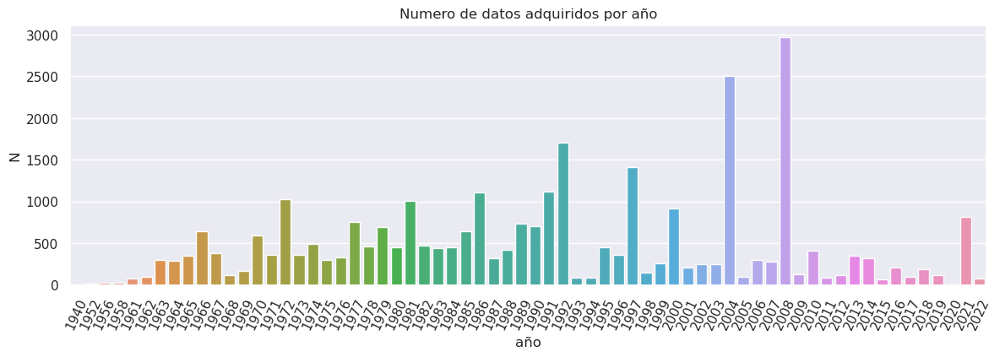
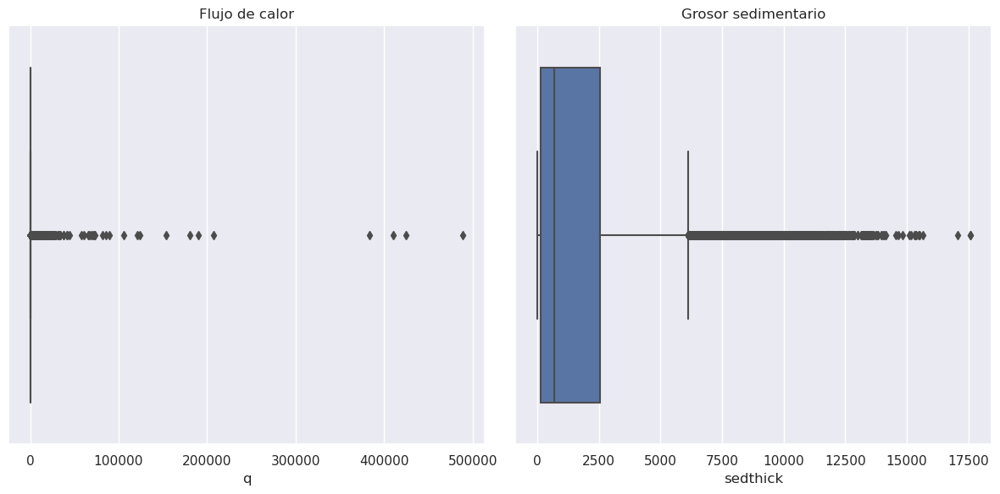

# Reporte de Datos

Este documento contiene los resultados del análisis exploratorio de datos.

## Resumen general de los datos

En esta sección se presenta un resumen general de los datos. Se describe el número total de observaciones, variables, el tipo de variables, la presencia de valores faltantes y la distribución de las variables.
> **Db1: The Global Heat Flow Database: Update 2023:** 
    
- El conjunto de datos se compone de $74547$ registros y $65$ variables. Sin embargo, solo $8$ variables son de interés para este proyecto.
- Debido al enfoque del proyecto solo se analizarán los datos de flujo de calor marino. Es decir solo se tomaron un total de $33103$ registros marinos del total de registros.
- Dichas variables son principalmente numéricas y tipo caracter.

| Columna     | Tipo    |
|-------------|---------|
| q           | float64 |
| lat         | float64 |
| lng         | float64 |
| elevation   | float64 |
| A_dom       | object  |
| A_reg       | object  |
| A_cont      | object  |
| A_year      | int64   |
- Los datos presentan un claro desbalance respecto a su representatividad para cada uno de los años de muestreo. Siendo los años $2008$, $2004$ y $1992$ con mayor cantidad de datos:

- Estos datos también presentan una alta varaibilidad junto con una considerable cantidad de valores anómalos:

- También, se observa un desbalance respecto a su representatividad respecto al domínio geográfico al que pertenecen los datos. Dicho domínio se define respecto a la placa tectónica donde se tomó el dato. Aunque, la placa pacífica es la más muestreada esta a su vez es la placa con mayor extensión espacial.

- Adicionalmente, el sesgo espacial de los datos debido a su distribución espacial no aleatoria se puede evidenciar en su representación geoespacial:

> **Db2: Total Sediment Thickness of the World's Oceans and Marginal Seas Version 3 (GlobSed):** 
    
- El conjunto de datos, es de tipo semi-estructurado, se compone de un mapa con una resolución de $5$ minutos de arco y un cubrimiento global continuo.

- De estos datos se extrajeron aquellos datos cuyas coordenadas coincidían con la localización de los datos de la `db1`. Un total de $32474$ datos de grosor sedimentario fueron extraídos para concatenar con el conjunto de datos `db1`.
Dicho procedimiento se representa en el siguiente mapa:
 

- Los conjuntos de datos `db1` y `db2` fueron fusionados a partir de la concatenación de los datos de grosor sedimentario con coordenadas cercanas a las de los datos de flujo de calor.
- Por lo que, las variables del nuevo conjunto junto con su tipología se presentan así:

| Columna     | Tipo    |
|-------------|---------|
| q           | float64 |
| lat         | float64 |
| lng         | float64 |
| elevation   | float64 |
| A_dom       | object  |
| A_reg       | object  |
| A_cont      | object  |
| A_year      | int64   |
| sedthick    | float64 |

Las distribución de las variables se presenta con los siguientes gráficos:

## Resumen de calidad de los datos

En esta sección se presenta un resumen de la calidad de los datos. Se describe la cantidad y porcentaje de valores faltantes, valores extremos, errores y duplicados. También se muestran las acciones tomadas para abordar estos problemas.
> **Db1: The Global Heat Flow Database: Update 2023:** 
- Se encontraron $603$ valores nulos para la variable `elevation`, dichos valores fueron excluidos.
- Se encontraron $26$ valores inconsistentes para `elevation` los cuales corresponden a `['Not specified', 'Unspecified']`, dichos valores fueron excluidos.
- Se encontraron $47$ valores inconsistentes de flujo de calor con valores negativos $q < 0$
 - Se hallaron $58$ valores anómalos de flujo de calor, identificados con un umbral de $3\sigma$.

 Quedando al final con un total de $30813$ registros
> **Db2: Total Sediment Thickness of the World's Oceans and Marginal Seas Version 3 (GlobSed):** 
 - Se encontraron $1543$ valores nulos para la variable `sedthick`, dichos valores fueron excluidos.
 - Se hallaron $721$ valores anómalos de grosor sedimentario, identificados con un umbral de $3\sigma$.

Quedando al final con un total de $30092$ registros.

## Variable objetivo

En esta sección se describe la variable objetivo. Se muestra la distribución de la variable y se presentan gráficos que permiten entender mejor su comportamiento.

> **Variable objetivo: Flujo de calor `q`**

La variable objetivos del proyecto es el flujo de calor en unidades [$mW/m^2$]. Según, estudios previos se a identificado que esta varaible parece estar estrechamente relacionada con el grosor sedimentario local. Por lo que, en el análisis exploratorio de datos se generaron gráficas para observar la correlación existente entre dichas variables:

## Variables individuales

En esta sección se presenta un análisis detallado de cada variable individual. Se muestran estadísticas descriptivas, gráficos de distribución y de relación con la variable objetivo (si aplica). Además, se describen posibles transformaciones que se pueden aplicar a la variable.

> **Variable individual: `sedthick`** 
La varaible de grosor sedimentario en unidades [$m$] se pretende utilizar como varaible individual para predecir la varaible objetivo. Dicha varaible parece tener un correlación negativa con la variable de flujo de calor, utilizando técnicas de correlación se calcula la matriz de correlación entre las varaibles numéricas del conjunto de datos.

*Se utiliza el coeficiente de spearman*

## Ranking de variables

En esta sección se presenta un ranking de las variables más importantes para predecir la variable objetivo. Se utilizan técnicas como la correlación, el análisis de componentes principales (PCA) o la importancia de las variables en un modelo de aprendizaje automático.

> Correlación entre variables:

Aunque, la varaible de flujo de calor junto con el grosor sedimentario parecen tener una correlación con la coordenada longitudinal, esto no es relevante, dado que, se sabe que esta relación esta determinado por la orientación de las dorsales meso-oceanicas que en general tienen una orientación oeste-este. 

Sin embargo, la existente correlación negativa entre el grosor sedimentario y el flujo de calor puede darnos información relevante para el objetivo del proyecto. En general se puede observar una relación exponencial entre dichas variables por lo que estas no presentan una correlación lineal sino de tipo exponencial.

## Relación entre variables explicativas y variable objetivo

En esta sección se presenta un análisis de la relación entre las variables explicativas y la variable objetivo. Se utilizan gráficos como la matriz de correlación y el diagrama de dispersión para entender mejor la relación entre las variables. Además, se pueden utilizar técnicas como la regresión lineal para modelar la relación entre las variables.

> **Correlación entre `q` y `sedthick`:**

Para visualizar la realción existente entre las varaibles de flujo de calor y grosor sedimentario es posible transformar dichas varaibles para realizar un mejor análisis de correlación. Debido a que, se puede evidenciar la relación exponencial entre dichas varaibles es posible aplicar una [transformación de potencia](https://scikit-learn.org/stable/modules/preprocessing.html#preprocessing-transformer). Dichas transformaciones son una familia de transformaciones paramétricas y monotónicas cuyo objetivo es asignar datos de cualquier distribución a una distribución lo más parecida posible a la de Gauss. Para este caso específico se utilizo una transformación de potencia utilizando el método `yeo-johnson` la cual es util para conjuntos de datos con valores positivos y negativos.

La transformada de Yeo-Johnson viene dada por:

$$\begin{split}x_i^{(\lambda)} = \begin{cases}[(x_i + 1)^\lambda - 1] / \lambda & \text{if } \lambda \neq 0, x_i \geq 0, \\[8pt]\ln{(x_i + 1)} & \text{if } \lambda = 0, x_i \geq 0 \\[8pt]-[(-x_i + 1)^{2 - \lambda} - 1] / (2 - \lambda) & \text{if } \lambda \neq 2, x_i < 0, \\[8pt] - \ln (- x_i + 1) & \text{if} \lambda = 2, x_i < 0\end{cases}\end{split}$$

*la transformación está parametrizada por $\lambda$ que se determina mediante una estimación de máxima verosimilitud.*

Adicionalmente, se calculo la matriz de correlación para estas dos variables transformadas opteniendo el siguiente resultado:

*Coeficiente de spearman*