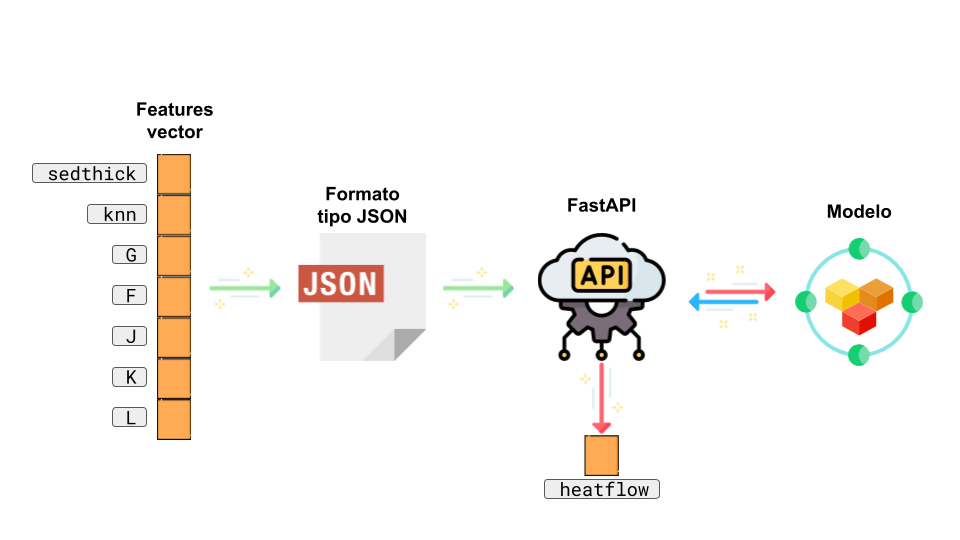

# Despliegue de modelos

## Infraestructura

- **Nombre del modelo:** (nombre que se le ha dado al modelo) 
> **Epsilon-Support Vector Regression OceanHeatMLFlow:** SVR para predecir flujo de calor utilizando datos de grosor sedimentario a partir de la implementación de *Scikit learn* `sklearn.svm.SVR()`
- **Plataforma de despliegue:** (plataforma donde se va a desplegar el modelo)
> El modelo será implementado y desplegado en un entorno local a través de una API utilizando FastAPI. FastAPI es un marco de desarrollo web de Python que permite construir rápidamente aplicaciones web de alto rendimiento y escalables.
- **Requisitos técnicos:** (lista de requisitos técnicos necesarios para el despliegue, como versión de Python, bibliotecas de terceros, hardware, etc.)
> - **Versión de Python:** python 3.11.3
> - **Librerias:** fastapi(0.98.0), pydantic(1.10.9), joblib(1.2.0), typing(4.6.3)
> - **Software:** Linux base OS (Manjaro Linux X86_64), kernel 6.2.16-MANJARO
> - **Hardware:** CPU: 11th Gen Intel i7-1195G7 (8) @ 5.000GHz, GPU: Intel TigerLake-LP GT2 [Iris Xe Graphics], RAM: 31804MiB
- **Requisitos de seguridad:** (lista de requisitos de seguridad necesarios para el despliegue, como autenticación, encriptación de datos, etc.)
> Validación de entrada de datos: Realiza una validación con `pydantic` de los datos de entrada enviados a la API. Esto incluye la verificación de tipos de datos. Al asegurarse de que los datos de entrada cumplan con los criterios esperados para prevenir ataques de inyección y garantizar la integridad de los datos.
- **Diagrama de arquitectura:** (imagen que muestra la arquitectura del sistema que se utilizará para desplegar el modelo)


## Código de despliegue

- **Archivo principal:** (nombre del archivo principal que contiene el código de despliegue)
> La aplicación diseñada está en el archivo:
> - `deploymentAPIs.py`
- **Rutas de acceso a los archivos:** (lista de rutas de acceso a los archivos necesarios para el despliegue)
> La ruta de acceso al API:
> - `./src/nombre_paquete/deployment/deploymentAPIs.py`
- **Variables de entorno:** (lista de variables de entorno necesarias para el despliegue)
> El despliegue no requiere de ninguna variable de entorno

## Documentación del despliegue

- **Instrucciones de instalación:** (instrucciones detalladas para instalar el modelo en la plataforma de despliegue)
> Es necesario instalar previamente las respectivas dependencias:
```
pip install fastapi==0.98.0 
pip install "uvicorn[standard]"
pip install pydantic==1.10.9 
pip install joblib==1.2.0
pip install typing==4.6.3
```
- **Instrucciones de configuración:** (instrucciones detalladas para configurar el modelo en la plataforma de despliegue)
> El el API no dispone de parámetros configurables para utilizar el modelo.
- **Instrucciones de uso:** (instrucciones detalladas para utilizar el modelo en la plataforma de despliegue)
> Para utilizar el modelo es necesario ubicarse en el directorio que contiene el archivo del API (`./src/nombre_paquete/deployment/`) utilizando el comando:
```
cd ./src/nombre_paquete/deployment/
```
> Una vez ubicado en dicho directorio es necesario ejecutar el servidor local utilizando el siguiente comando:
```
uvicorn deploymentAPIs:app --reload
```
> Dicho comando nos proporcionará la dirección y puerto donde estará corriendo el API (`http://127.0.0.1:8000` sustituyendo la dirección IP por la propia). Por medio del navegador podemos conectarnos al API utilizando dicha dirección.

> Para realizar una predicción, utilizando el modelo desplegado por medio de nuestra API, es necesario hacer una petición tipo `POST` por medio de cualquier herramienta que soporte peticiones `HTTP`. En este caso se proporciona un *script* para realizar una petición de prueba, que puede ser modificado para realizar nuevas peticiones, este archivo se dispone en la siguiente ruta:

```
./src/nombre_paquete/deployment/API_test.py
```
> En este *script* se proporciona un ejemplo de petición `POST`, utilizando el paquete `request`, para realizar una predicción proporcionando un archivo tipo `JSON` como entrada al modelo. Este contiene un vector con siete valores (input features): 
```
{
    "features_7": ['sedthick', 'knn', 'G', 'F', 'J', 'K', 'L']
    }
```
> El API recibirá esta petición y retornará la predicción de flujo de calor generada por el modelo en unidades [$mW/m^2$]. Dicha predicción se proporcionará en el siguiente formato:
```
{'heatflow': [85.09385229374061]}
``` 
- **Instrucciones de mantenimiento:** (instrucciones detalladas para mantener el modelo en la plataforma de despliegue)
> Para mantener el modelo en la plataforma de despliegue, es importante asegurar un control de versiones en sincronía con el código del API. Para esto es necesario el uso de un sistema de control de versiones (Git, DVC y MLFlow) para gestionar el código fuente del modelo facilitando el seguimiento de cambios para la actualización del código del API de despliegue. 