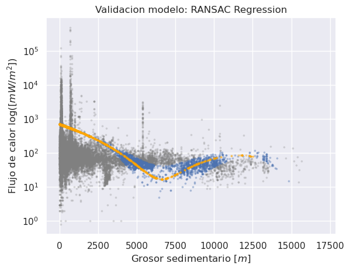

# Reporte del Modelo Baseline

Este documento contiene los resultados del modelo baseline.

## Descripción del modelo

El modelo baseline es el primer modelo construido y se utiliza para establecer una línea base para el rendimiento de los modelos posteriores.

> En nuestro estudio, hemos utilizado el modelo de **regresión polinomial cúbica RANSAC** como nuestro enfoque de línea de base según lo consultado en la literatura [Stål, T., Reading, A. M., Halpin, J. A., & Whittaker, J. M. (2021)](https://agupubs.onlinelibrary.wiley.com/doi/full/10.1029/2020GC009428). Este modelo es una extensión del algoritmo RANSACRegressor que utiliza una función polinomial cúbica para ajustar los datos. El objetivo de este modelo es capturar relaciones no lineales y lidiar con los valores atípicos que puedan sesgar la regresión. La función polinomial cúbica nos permite modelar efectos no lineales, lo cual es útil teniendo en cuenta la relación observada entre el flujo de calor y el grosor sedimentario. El algoritmo `RANSACRegressor`, por su parte, nos ayuda a lidiar con valores atípicos o ruido en los datos al ajustar el modelo solo a los puntos que presentan un mejor ajuste. Al utilizar el Polynomial Cubic RANSACRegressor como nuestro modelo base, aw busca evaluar su desempeño en comparación con otros modelos para determinar si es posible implementar alguna mejora significativa en la capacidad de predicción del flujo de calor marino.

## Variables de entrada

Lista de las variables de entrada utilizadas en el modelo.
| input | output |
| -------- | -------- |
| `sedthick`  | `q`  |

## Variable objetivo

Nombre de la variable objetivo utilizada en el modelo.
> **Variable objetivo:** `q` = Flujo de calor $[mW/m^2]$ 
## Evaluación del modelo

### Métricas de evaluación

Descripción de las métricas utilizadas para evaluar el rendimiento del modelo.
| Métricas | siglas | método |
| -------- | -------- | -------- |
| Error medio cuadrático  | MSE  | `mean_squared_error()`  |
| Error medio absoluto  | MAE  | `mean_absolute_error()`  |
|  coeficiente de determinación  | R2  | `r2_score()`  |
> **MSE:** evalúa la calidad de un modelo de regresión. Esta calcula el promedio de los errores al cuadrado entre las predicciones del modelo y los valores reales de la variable objetivo. El MSE tiene la propiedad de penalizar de manera más significativa los errores grandes, debido al término al cuadrado. Un valor de MSE igual a cero indica un ajuste perfecto del modelo a los datos observados, donde las predicciones coinciden exactamente con los valores reales. En general, se busca minimizar el MSE para lograr una mejor precisión del modelo.

>  **MAE:** a diferencia del MSE (Mean Squared Error), que penaliza los errores al cuadrado, el MAE calcula el promedio de los errores absolutos entre las predicciones del modelo y los valores reales de la variable objetivo. Es una medida de la magnitud promedio de los errores absolutos, lo que significa que no tiene en cuenta la dirección de los errores, solo su magnitud pero. Además, es fácil de interpretar debido a que está en las mismas unidades que la variable objetivo. Un valor de MAE igual a cero indica un ajuste perfecto del modelo a los datos observados.

> **R2:** es una métrica utilizada para evaluar la calidad del ajuste de un modelo de regresión. Representa la proporción de la varianza de la variable objetivo que es explicada por el modelo. Un valor de R2 cercano a 1 indica que el modelo es capaz de explicar la mayoría de la variabilidad de los datos observados. Por otro lado, un valor cercano a 0 indica que el modelo no puede explicar bien la variabilidad de los datos.
### Resultados de evaluación

Tabla que muestra los resultados de evaluación del modelo baseline, incluyendo las métricas de evaluación.

| MSE | MAE | R2 |
| -------- | -------- | -------- |
| 7.723634e+06  | 445.464788  | -0.007605  |
		
## Análisis de los resultados

Descripción de los resultados del modelo baseline, incluyendo fortalezas y debilidades del modelo.
> El **MAE** obtenido es de  $445.46 mW/m^2$, lo que indica que, en promedio, las predicciones del modelo difieren en $445.46$ unidades de los valores reales.

> El **MSE** obtenido es de 7.723634e+06, lo que implica que la variabilidad de los errores al cuadrado entre las predicciones y los valores reales sigue siendo bastante alta. Un MSE elevado indica que el modelo aún tiene dificultades para ajustarse adecuadamente a los datos observados y generar predicciones precisas.

> El coeficiente de determinación (R2) obtenido es de -0.007605, lo cual es muy bajo y negativo. Un valor de R2 negativo indica que el modelo no es capaz de explicar la variabilidad de los datos y está generando predicciones alejadas de los valores reales. Este resultado sugiere que el modelo actualizado no es adecuado para el conjunto de datos y no está proporcionando un ajuste significativo.

## Conclusiones

Conclusiones generales sobre el rendimiento del modelo baseline y posibles áreas de mejora.

En resumen, el modelo baseline mostró un rendimiento insatisfactorio en términos de su capacidad predictiva y explicativa. Para mejorar el modelo, se recomienda explorar diferentes algoritmos, ajustar los hiperparámetros y considerar características adicionales para lograr resultados más precisos y útiles.

## Referencias

Lista de referencias utilizadas para construir el modelo baseline y evaluar su rendimiento.

> Stål, T., Reading, A. M., Halpin, J. A., & Whittaker, J. M. (2021). Antarctic Geothermal Heat Flow Model: Aq1. Geochemistry Geophysics Geosystems, 22(2). https://doi.org/10.1029/2020gc009428
