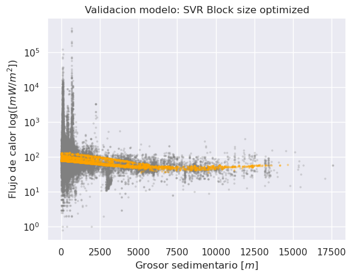

# Reporte del Modelo Final

## Resumen Ejecutivo

En esta sección se presentará un resumen de los resultados obtenidos del modelo final. Es importante incluir los resultados de las métricas de evaluación y la interpretación de los mismos.

## Descripción del Problema

En esta sección se describirá el problema que se buscó resolver con el modelo final. Se debe incluir una descripción detallada del problema, el contexto en el que se desarrolla, los objetivos que se persiguen y la justificación del modelo.

> El problema que se buscó resolver con el modelo final fue lograr una mejor predicción de la variable objetivo (Flujo de calor marino) a una escala global. Esta mejora en la predicción es alcanzada implementado un modelo Support Vector Regression (`SVR`) junto con un conjunto de características derivadas de la distribución espacial de los datos (`knn`, `G`, `F`, `J`, `K`, `L`). El objetivo es desarrollar un modelo que pueda realizar predicciones precisas de la variable objetivo utilizando las características proporcionadas.

## Descripción del Modelo

En esta sección se describirá el modelo final que se desarrolló para resolver el problema planteado. Se debe incluir una descripción detallada del modelo, la metodología utilizada y las técnicas empleadas.

> **Modelo final:** SVR es una técnica de regresión que se basa en Support Vector Machines (SVM). A diferencia de la regresión lineal tradicional, SVR es capaz de manejar datos no lineales y capturar relaciones más complejas entre las variables predictoras y la variable objetivo. El objetivo de SVR es encontrar una función de decisión que se ajuste a los datos de entrenamiento con un margen de error aceptable.

> **Metodología utilizada:** Para implementar el modelo SVR, se siguieron los siguientes pasos:

> **1. Extracción de características:** Se realizaron relaciones espaciales dentro de conjuntos de datos para extraer características espaciales utilizando un enfoque basado en la medición de distancias entre puntos y la aplicación de técnicas estadísticas de agrupamiento espacial.

> **2. División de datos:** Los datos se dividieron en conjuntos de entrenamiento y prueba. Dicha división tuvo en cuenta el carácter de espacial de los datos aplicando un enfoque en bloques y no aleatorio. El conjunto de entrenamiento se utilizó para ajustar el modelo y el conjunto de prueba se utilizó para evaluar el rendimiento y la precisión del modelo.

> **3. Entrenamiento del modelo:** Se ajustó el modelo SVR utilizando el conjunto de entrenamiento. Dicho conjunto consistió de la variable de grosor sedimentario junto con las características espaciales extraidas.

| input | output |
| -------- | -------- |
| `sedthick`, `knn`, `G`, `F`, `J`, `K`, `L` | `q`  |

## Evaluación del Modelo

En esta sección se presentará una evaluación detallada del modelo final. Se deben incluir las métricas de evaluación que se utilizaron y una interpretación detallada de los resultados.

> El modelo final fue evaluado utilizando tres métricas comunes en problemas de regresión: Mean Squared Error (MSE), Mean Absolute Error (MAE) y Coefficient of Determination (R2). A continuación se presenta una evaluación detallada de cada una de estas métricas y una interpretación de los resultados obtenidos:

|Métrica|Modelo Final|Modelo Base|
|---|---|---|
|MSE|7.672432e+06|7.723634e+06|
|MAE|160.249916|445.464788|
|R2|-0.000926|-0.007605|

> En términos del MSE, el modelo base presenta un valor ligeramente mayor (7.723634e+06) en comparación con el modelo final (7.672432e+06). Un MSE más bajo indica un mejor rendimiento, por lo tanto, el modelo final es ligeramente mejor en este aspecto.

> En cuanto al MAE, el modelo base muestra un valor más alto (445.464788) en comparación con el modelo final (160.249916). Un MAE más bajo indica una mejor precisión, por lo tanto, el modelo final es superior en términos de la desviación promedio entre las predicciones y los valores reales.

> En cuanto al coeficiente de determinación R2, el modelo base también muestra un valor más bajo (-0.007605) en comparación con el modelo final (-0.000926). Un valor de R2 más alto indica una mejor capacidad explicativa, por lo tanto, el modelo final es ligeramente mejor en este aspecto.

## Conclusiones y Recomendaciones

En esta sección se presentarán las conclusiones y recomendaciones a partir de los resultados obtenidos. Se deben incluir los puntos fuertes y débiles del modelo, las limitaciones y los posibles escenarios de aplicación.

> En resumen, los resultados de las métricas de evaluación para el modelo final indican un rendimiento insatisfactorio. El alto MSE y el MAE significativo indican que el modelo tiene dificultades para hacer predicciones precisas y tiende a cometer errores significativos. Además, el valor de R2 cercano a cero o negativo sugiere que el modelo no puede explicar adecuadamente la variabilidad de la variable objetivo.

> Estos resultados revelan la necesidad de mejorar el modelo final y explorar otras técnicas o enfoques que puedan proporcionar una mejor capacidad predictiva y explicativa. Sin embargo, los resultados indican que el modelo final presenta un MSE ligeramente menor, un MAE significativamente menor y un R2 más bajo en comparación con el modelo base. Esto sugiere que el modelo final tiene un rendimiento generalmente mejor que el modelo base en términos de precisión y capacidad explicativa.

## Referencias

En esta sección se deben incluir las referencias bibliográficas y fuentes de información utilizadas en el desarrollo del modelo.
